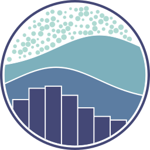

<!--
**JoshuaMillerCode/JoshuaMillerCode** is a ✨ _special_ ✨ repository because its `README.md` (this file) appears on your GitHub profile.

Here are some ideas to get you started:

- 🔭 I’m currently working on ...
- 🌱 I’m currently learning ...
- 👯 I’m looking to collaborate on ...
- 🤔 I’m looking for help with ...
- 💬 Ask me about ...
- 📫 How to reach me: ...
- 😄 Pronouns: ...
- ⚡ Fun fact: ...
-->
<!-- -->
<!--  -->

<h1 align="center">
  
</h1>

  About Me:

  Hello, I'm Joshua Miller, Full Stack Developer and Educationist out of Houston, TX
   
   
  👨🏻‍💻 Full Stack Software Engineer with 3+ years of experience and a track record of creating exceptional projects, driving change, and solving complex code problems. Adept at providing educational instruction and hands-on development,
demonstrating a strong commitment to collaboration and innovation.
   
   
  💻 I love writing code, and learning anything about it 🤯
   
    
  📱 I’m currently focusing on Full Stack/Mobile Development 
   
  📫 How to reach me 👇

 
 

  <!--   --> 
   <!--  -->
<!--    -->
 <!--   -->
  <!--     -->
  

<h2 align="center">🔥 Languages & Frameworks & Tools & Abilities 🔥</h2> 

<!--   <code></code> -->
  <!-- </code> -->
 
<!--   <code></code> -->
  <!--  -->
  <!--  -->
  <!-- 
  
  
   -->
   <!-- 
    
   
  
  
  
  
  
   -->
  

  

  
  
  <!--  -->
<!--   <code></code> -->

<h2 align="center">⚡ Stats ⚡</h2>
 

<h2 align="center">💹 Featured Repos 💹</h2>
 

   
  
    
<!--     -->

<!-- 

  

 -->

<!--

       

-->

  

<!-- <iframe src="https://joshuarmiller.dev/assets/Joshua-Miller-Full%20Stack%20Software%20Engineer.pdf" width=100% height=500></iframe> -->

